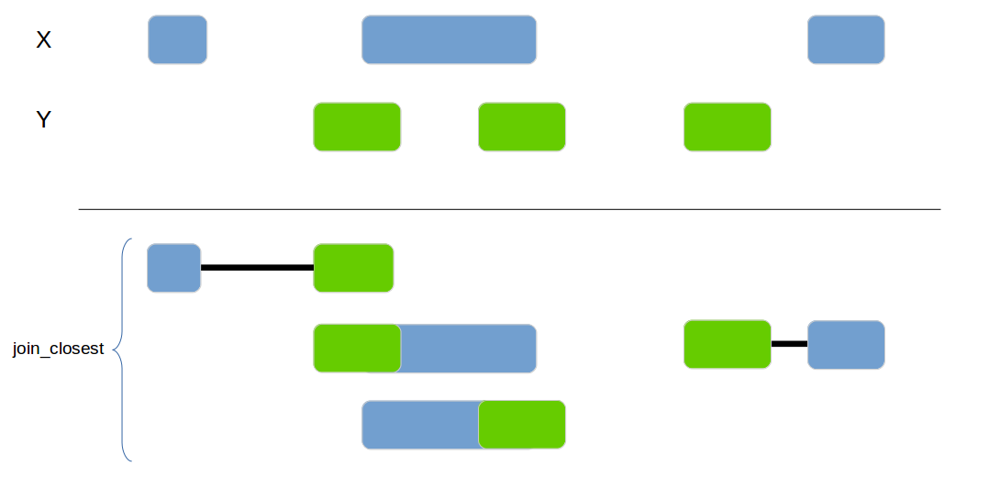
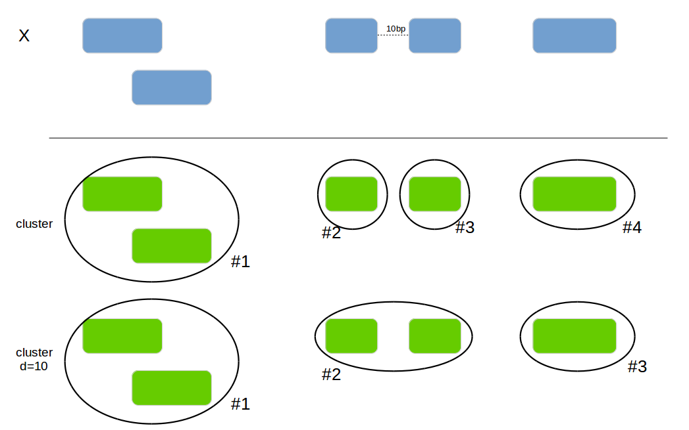

# tidygenomics

Tidy Verbs for Dealing with Genomic Data Frames

## Description

Handle genomic data within data frames just as you would with `GRanges`.
This packages provides method to deal with genomics intervals the "tidy-way" which makes
it simpler to integrate in the the general data munging process. The API is inspired by the
popular bedtools and the genome_join() method from the fuzzyjoin package.

## Installation

```
devtools::install_github("Artjom-Metro/tidygenomics")
```

## Documentation


#### genome_intersect

Joins 2 data frames based on their genomic overlap. Unlike the `genome_join` function it updates the boundaries to reflect
the overlap of the regions.


```{r}
x1 <- data.frame(id = 1:4, 
                chromosome = c("chr1", "chr1", "chr2", "chr2"),
                start = c(100, 200, 300, 400),
                end = c(150, 250, 350, 450))

x2 <- data.frame(id = 1:4,
                 chromosome = c("chr1", "chr2", "chr2", "chr1"),
                 start = c(140, 210, 400, 300),
                 end = c(160, 240, 415, 320))

genome_intersect(x1, x2, by=c("chromosome", "start", "end"), mode="both")
```

| id.x|chromosome | id.y| start| end|
|----:|:----------|----:|-----:|---:|
|    1|chr1       |    1|   140| 150|
|    4|chr2       |    3|   400| 415|

#### genome_subtract

Subtracts one data frame from the other. This can be used to split the x data frame into smaller areas.


```{r}
x1 <- data.frame(id = 1:4,
                chromosome = c("chr1", "chr1", "chr2", "chr1"),
                start = c(100, 200, 300, 400),
                end = c(150, 250, 350, 450))

x2 <- data.frame(id = 1:4,
                chromosome = c("chr1", "chr2", "chr1", "chr1"),
                start = c(120, 210, 300, 400),
                end = c(125, 240, 320, 415))

genome_subtract(x1, x2, by=c("chromosome", "start", "end"))
```

| id|chromosome | start| end|
|--:|:----------|-----:|---:|
|  1|chr1       |   100| 119|
|  1|chr1       |   126| 150|
|  2|chr1       |   200| 250|
|  3|chr2       |   300| 350|
|  4|chr1       |   416| 450|


#### genome_join_closest

Joins 2 data frames based on their genomic location. If no exact overlap is found the next closest interval is used.



```{r}
x1 <- data_frame(id = 1:4, 
                 chr = c("chr1", "chr1", "chr2", "chr3"),
                 start = c(100, 200, 300, 400),
                 end = c(150, 250, 350, 450))

x2 <- data_frame(id = 1:4,
                 chr = c("chr1", "chr1", "chr1", "chr2"),
                 start = c(220, 210, 300, 400),
                 end = c(225, 240, 320, 415))
genome_join_closest(x1, x2, by=c("chr", "start", "end"), distance_column_name="distance", mode="left")
```

| id.x|chr.x | start.x| end.x| id.y|chr.y | start.y| end.y| distance|
|----:|:-----|-------:|-----:|----:|:-----|-------:|-----:|--------:|
|    1|chr1  |     100|   150|    2|chr1  |     210|   240|       59|
|    2|chr1  |     200|   250|    1|chr1  |     220|   225|        0|
|    2|chr1  |     200|   250|    2|chr1  |     210|   240|        0|
|    3|chr2  |     300|   350|    4|chr2  |     400|   415|       49|
|    4|chr3  |     400|   450|   NA|NA    |      NA|    NA|       NA|

#### genome_cluster

Add a new column with the cluster if 2 intervals are overlapping or are within the `max_distance`.



```{r}
x1 <- data.frame(id = 1:4, bla=letters[1:4],
                chromosome = c("chr1", "chr1", "chr2", "chr1"),
                start = c(100, 120, 300, 260),
                end = c(150, 250, 350, 450))
genome_cluster(x1, by=c("chromosome", "start", "end"))
```

| id|bla |chromosome | start| end| cluster_id|
|--:|:---|:----------|-----:|---:|----------:|
|  1|a   |chr1       |   100| 150|          0|
|  2|b   |chr1       |   120| 250|          0|
|  3|c   |chr2       |   300| 350|          2|
|  4|d   |chr1       |   260| 450|          1|

```{r}
genome_cluster(x1, by=c("chromosome", "start", "end"), max_distance=10)
```

| id|bla |chromosome | start| end| cluster_id|
|--:|:---|:----------|-----:|---:|----------:|
|  1|a   |chr1       |   100| 150|          0|
|  2|b   |chr1       |   120| 250|          0|
|  3|c   |chr2       |   300| 350|          1|
|  4|d   |chr1       |   260| 450|          0|

#### genome_complement

Calculates the complement of a genomic region.


```{r}
x1 <- data.frame(id = 1:4,
                 chromosome = c("chr1", "chr1", "chr2", "chr1"),
                 start = c(100, 200, 300, 400),
                 end = c(150, 250, 350, 450))

genome_complement(x1, by=c("chromosome", "start", "end"))
```

|chromosome | start| end|
|:----------|-----:|---:|
|chr1       |     1|  99|
|chr1       |   151| 199|
|chr1       |   251| 399|
|chr2       |     1| 299|


#### genome_join

Classical join function based on the overlap of the interval. Implemented and mainted in the
[fuzzyjoin](https://github.com/dgrtwo/fuzzyjoin) package and documented here only for completeness.


```{r}
x1 <- data_frame(id = 1:4, 
                 chr = c("chr1", "chr1", "chr2", "chr3"),
                 start = c(100, 200, 300, 400),
                 end = c(150, 250, 350, 450))

x2 <- data_frame(id = 1:4,
                 chr = c("chr1", "chr1", "chr1", "chr2"),
                 start = c(220, 210, 300, 400),
                 end = c(225, 240, 320, 415))
fuzzyjoin::genome_join(x1, x2, by=c("chr", "start", "end"), mode="inner")
```

| id.x|chr.x | start.x| end.x| id.y|chr.y | start.y| end.y|
|----:|:-----|-------:|-----:|----:|:-----|-------:|-----:|
|    2|chr1  |     200|   250|    1|chr1  |     220|   225|
|    2|chr1  |     200|   250|    2|chr1  |     210|   240|

```{r}
fuzzyjoin::genome_join(x1, x2, by=c("chr", "start", "end"), mode="left")
```

| id.x|chr.x | start.x| end.x| id.y|chr.y | start.y| end.y|
|----:|:-----|-------:|-----:|----:|:-----|-------:|-----:|
|    1|chr1  |     100|   150|   NA|NA    |      NA|    NA|
|    2|chr1  |     200|   250|    1|chr1  |     220|   225|
|    2|chr1  |     200|   250|    2|chr1  |     210|   240|
|    3|chr2  |     300|   350|   NA|NA    |      NA|    NA|
|    4|chr3  |     400|   450|   NA|NA    |      NA|    NA|

```{r}
fuzzyjoin::genome_join(x1, x2, by=c("chr", "start", "end"), mode="anti")
```

| id|chr  | start| end|
|--:|:----|-----:|---:|
|  1|chr1 |   100| 150|
|  3|chr2 |   300| 350|
|  4|chr3 |   400| 450|


## Inspiration

- [tidyverse](http://tidyverse.org/)
- [fuzzyjoin](https://github.com/dgrtwo/fuzzyjoin)
- [GenomicRanges](http://bioconductor.org/packages/release/bioc/html/GenomicRanges.html)
- [bedtools](http://bedtools.readthedocs.io)

If you have any additional questions or encounter issues please raise them on the [github page](https://github.com/Artjom-Metro/tidygenomics).


